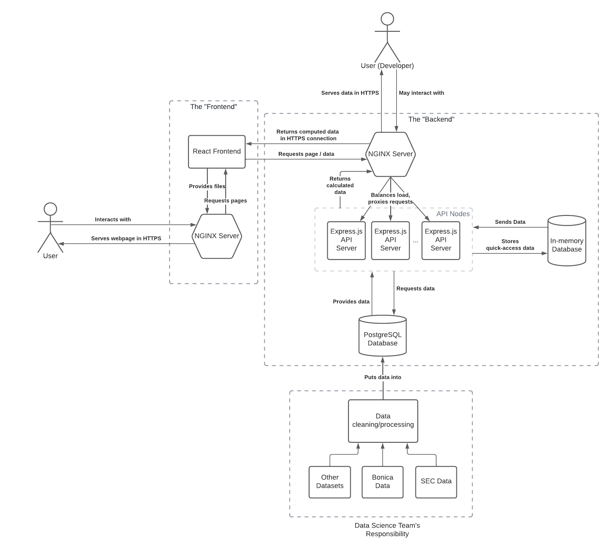
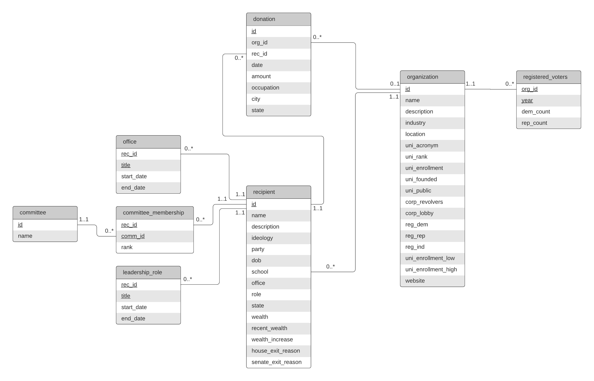

# VotingBuck Backend

Votingbuck's backend. Currently hosted at https://api.votingbuck.com/.

Express.js API. Features:

- [TypeScript](https://www.typescriptlang.org/docs/handbook/intro.html)
- [Npm](https://www.npmjs.com/) (v8)
- [Node](https://nodejs.org/en/download/) (v16.13.0)
- [Nodemon](https://github.com/remy/nodemon) for autorestart on file save
- [ESLint](https://eslint.org/) and [Prettier](https://marketplace.visualstudio.com/items?itemName=esbenp.prettier-vscode) for linting + [Husky](https://github.com/typicode/husky) & [lint-staged](https://github.com/okonet/lint-staged#readme) for auto-linting on git commit
- [Jest](https://jestjs.io/) for testing
- [SWC](https://github.com/swc-project/swc) compiler for building
- [Swagger](https://editor.swagger.io/) for pretty API (available under route `/`)
- [Prisma](https://www.prisma.io/) (ORM)

Deployment:

- On AWS EC2
- [NGINX](https://www.nginx.com/) (as reverse proxy, load balancer, https server)
- Multi-stage Docker & Docker compose
- CI/CD for automatic test, build, and deployment

Based on this boilerplate: https://github.com/ljlm0402/typescript-express-starter

## Running the App

**Development**

First, make sure you have a local instance of Redis (and RedisSearch) running. You can do so with

    sudo docker network create 4470-backend_backend
    sudo docker-compose create redis
    sudo docker-compose start redis
    sudo docker exec redis redis-cli FT.CREATE index ON HASH PREFIX 1 entity SCORE 0.000001 SCORE_FIELD score STOPWORDS 0 SCHEMA name TEXT NOSTEM SORTABLE category TAG  id NUMERIC

Then, define all your environment variables. You may create a `.env` file containing:

    PORT=3000
    REDIS_HOST=127.0.0.1
    REDIS_PORT=6379
    REDIS_INDEX_NAME=index
    DATABASE_URL="<secret>"

Then, use `npm run dev`.

**Production**

Alternatively, to run the production containers use `sudo docker-compose up -d --build`.

You will also need a `/env` file for this. The only difference is that it uses REDIS_HOST=redis:

    PORT=3000
    REDIS_HOST=redis
    REDIS_PORT=6379
    REDIS_INDEX_NAME=index
    DATABASE_URL="<secret>"

# Developer Information

## Architecture

Votingbuck's architecture is separated into three areas, [the frontend](https://github.com/Caleb-Sutherland/4470-frontend), the backend (described herein), and the data science pipeline.

The frontend is a React app that is served via Nginx.

The backend consists of many parts:

- Express.js Nodes: these are containerized versions of the Express.js server in this repository.
- The Nginx server: receives all requests and forwards them to Express.js nodes while balancing the load. It also handles SSL certificates (HTTPS) with Let's Encrypt. Users may interact with it directly via the Swagger interface at api.votingbuck.com.
- PostgreSQL database: our main database. It contains all the data on politicians, donations, organization, universities, etc. As of April 2022, it contains both real data and dummy data. The data science team is steadily cleaning real data from the Federal Election Commission (FEC) and making it available to us. This database is expected to have around 20 GB of data when mature.
- In-memory database (Redis): this is an auxiliary database utilized to support the Express.js server and allow for faster queries. For example, the search endpoint utilizes Redis to enable very fast response times in the search bar of the website (i.e. the user will see results as they type in the search box, just like Google).

The data science pipeline is handled by a different team. Primarily, this portion of the work involves cleaning up data from the Federal Election Commission (FEC) and utilizing political science techniques to get accurate data in a nice, clean format that is accepted by our Postgres database.

## AWS Deployment

The following AWS services are used to deploy the backend and frontend

- EC2: One node is used for the backend containers (Nginx, Redis, express.js) and another one is used for the frontend (Nginx).
- ECR: Used by both frontend and backend to store Docker images so they can be fetched by EC2. In the backend, the CI/CD pipeline takes care of building images, pushing them to ECR, pulling them from EC2, and more.
- RDS: Hosts our Postgres database.
- IAM: sed to manage roles and control access
- Route 53: DNS server used to control the votingbuck.com domain. Points dev.votingbuck.com to one EC2 node, and api.votingbuck.com to another.

Note: currently, only one version of the app is deployed, which is sufficient but the time being (as at April 2022). In the near future, two deployments (dev & prod) should be considered.

## Database Design (Postgres)

_By Jack Hillier_

The schema is built around donations from organizations (corporations or universities) to recipients (politicians). The `donation` table contains the information relating to these donations including the receiving politician as a foreign key to the `recipient` table and the contributing organization as a foreign key to the `organization` table (donations do not always have a contributing organization).

The `organization` table contains information relating to the contributing party of a donation which is limited to a university or a corporation. The table contains some fields that are applicable to only one type of organization (e.g., `uni_rank` for universities and `corp_revolvers` for corporations). (The field `uni_enrollment` is deprecated in favor of `uni_enrollment_low` and `uni_enrollment_high`.) The `registered_voters` table contains the count of registered democrats and republicans in an organization along with the year the numbers were collected (the three fields in `organization` that start with 'reg' are deprecated and replaced by this table.)

The `recipient` table contains information relating to the receiving party of a donation which is exclusively a politician. This includes a reference to the alma mater of a politician (if they have one) in reference via foreign key to an entry of the `organization` table. There are also three tables relating to a recipient: `office`, `committee_membership`, and `leadership_role`. The `office` table records the periods a politician has held an office. The `committee_membership` table records the committees of which the politician is a member (committees are found in the `committee` table). The `leadership_role` table records the periods a politician has had a special role.

## Changes to the Database

As far as the backend is concerned, Whenever there are changes to the database schema or contents (RDS), you must

1.  **Update the Prisma schema**. This schema is the backend's definition of the database, including data model definitions, data sources, etc. See
2.  **Flush Redis**. This will ensure the search endpoint is up-to-date with the persistent database.

### Updating the Prisma schema

According to the [Prisma docs](https://www.prisma.io/docs/getting-started/setup-prisma/add-to-existing-project/relational-databases/next-steps-typescript-postgres), whenever you change the database schema, you must

1.  Re-introspect your database with `npx prisma db pull`
2.  (Optional) Re-configure your Prisma client (`schema.prisma`)
3.  Re-generate Prisma Client with `npx prisma generate`

### Flushing Redis

A PEM key should be provided to you.

First, ssh into the AWS EC2 node

    ssh -i <location of pem key>.pem <ec2 username>@<ec2 url>.us-east-2.compute.amazonaws.com

Then, get into Redis

    docker exec -it redis redis-cli

Then, run the following commands to flush Redis

    FLUSHALL
    FT.CREATE index ON HASH PREFIX 1 entity SCORE 0.000001 SCORE_FIELD score STOPWORDS 0 SCHEMA name TEXT NOSTEM SORTABLE category TAG  id NUMERIC

Lastly, restart the Express.js node(s) to trigger the `populateRedisSearch` function and, naturally, repopulate Redis with the new data from Postgres.

    docker restart server

## RedisSearch

To set up the RedisSearch index, do this only once after starting the RedisSearch container:

    FT.CREATE index ON HASH PREFIX 1 entity SCORE 0.000001 SCORE_FIELD score STOPWORDS 0 SCHEMA name TEXT NOSTEM SORTABLE category TAG  id NUMERIC

Then, to add a politician/university/corporate, use

    HSET search:<pol/uni/cor>:<entitys_id> name "<name>" category <politician/university/corporate> id <entitys_id> score <score>

where

- `<name>` is the entity's name, like "Joe Biden" or "Apple"
- `<entitys_id>` is the pol/uni/cor's id in the SQL database
- `<score>` is a number between 0.0 and 1.0 corresponding to their score

Example

    HSET entity:pol:42 name "Donald Trump" category politician id 42 score 0.978777

See section below for information on Score.

The index must be populated once every time the SQL database is changed (or whenever it is empty). A function exists in `search.service.ts` to do that.

To search, use

    FT.SEARCH index "(%<query[term_n]>%|%<query[term_n]>%|query*) @category:{<politician/university/corporate>}" SCORER DOCSCORE LIMIT 0 <max_results>

Example for query "joe bide"

    FT.SEARCH index "(%joe%|%bide%|joe bide*) @category:{politician}" SCORER DOCSCORE LIMIT 0 2

(returns Joe Biden; read about [query syntax](https://oss.redis.com/redisearch/Query_Syntax))

To populate the RedisSearch index, a function exists in search.services code that is called once every time the app starts if the index is empty/non-existent.

### Scoring function

We want to rank entities (pol/org/unis) higher if they are more likely to be one that is interesting. For example, a popular politician should rank higher in search results than one that isn't well-known. To achieve that, we use our own scoring function.

Each one of the three categories of entities has its own scoring criteria

- Universities: univeristy ranking
- Corporates: number of revolvers
- Politicians: wealth

These are not perfect criteria, but they are all attributes of the `organization` or `politician` table, so easy to fetch. Ideally, we would want the score to be the amount of money an entity has donated (in the case of corporates or unis) or received (politicians), but that is a wish-list suggestion for the future.

The formula to calculate the scores for each entity type is:

- Universities: `1 - (1/(1 + x/<AVERAGE ranking, e.g. 100>)) × 0.9`
- Corporates: `1 - (1/(1 + x/<AVERAGE number of revolvers, e.g. 100>)) × 0.9`
- Politicians: `1 - (1/(1 + x/<AVERAGE wealth, e.g. 100>)) × 0.9`

Scores must be between 0.o and 1.0. The above functions map everything to in the [0, 1.0) range.

## Backend deployment

Currently, only a production version of the system exists. This is sufficient for the moment, but not ideal for the future.

To deploy a new version of the app to production, simply create a Pull Request. GitHub will take care of Build, Test, and Deployment as per the specifications in `.github/workflows/main.yml`. This will override the current production deployment (which is partially why a dev deployment should be added).
